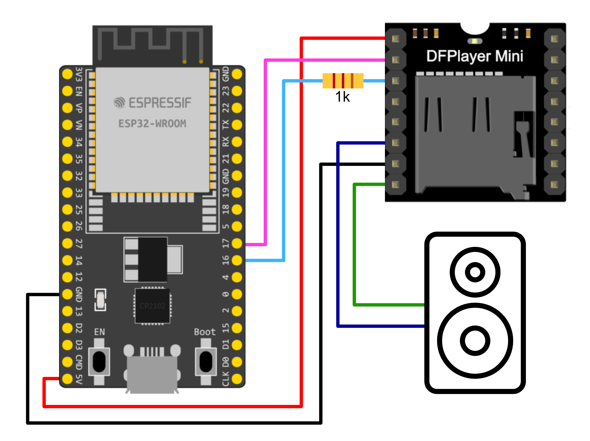

# Async DFPlayer Mini Library for MicroPython
This is a fully featured library for the DFPlayer Mini MP3 player by DFRobot.
It also supports other manufacturer's versions of the module.

The library is meant to be used in conjunction with the `asyncio` library.
All methods that interface with the DFPlayer must be awaited until
the player acknowledged the command/returned a queried value.


## Resources ##
📖 [**Documentation**](https://muhlex.github.io/dfplayer-mp/)<br>
🌐 [**DFRobot Wiki**](https://wiki.dfrobot.com/DFPlayer_Mini_SKU_DFR0299) (original arduino library)

## Required Hardware ##
- 1 x micro SD card with 16 or 32 GB
- 1 x DFPlayer Mini
- 1 x microcontroller with UART capabilities
- 1 x speaker (max 3 Watt can be powered directly)
- 1 x 1k Resistor (optional)

## Wiring ##
For this wiring diagram an *ESP32 WROOM Dev Kit* is used, but any microcontroller with UART capabilities should work.

The *1k resistor* is optional, but removes noise from the speaker at the cost of some volume.
In this example, Pins *16 (RX)* and *17 (TX)* are used with is the default position for serial port 2 (*UART2*).
It is not advisable to use *UART0* (which is marked as RX and TX on the board itself), because this is the same connection that is used by the USB interface and will cause problems, when the microcontroller is connected to the PC, resulting in the board not responding.
Also, RX and TX need to be swapped for this to work (RX connected to TX and vise versa).

## SD Card ##
The used micro SD card needs to be either 16 or 32 GB and formatted in *FAT32*.
The audio files can be either *mp3* or *WAV* and need to be stored using this file structure:
- 01
	- 000.mp3
	- …
	- 999.mp3
- 02
	- 000.WAV
	- …
	- 999.WAV

## File Structure ##
For the library to work correctly, a specified file structure on the microcontroller is recommended:
- lib
	- dfplayer
		- \_\_init\_\_.py
		- dfplayer.py
- main.py
- *the rest of your files*
## Example Code ##

### Basic Usage ###

```python
from asyncio import run
from dfplayer import DFPlayer

async def main():
	# using UART2
    df = DFPlayer(2)
    df.init()
    await df.wait_available() # Optional, make sure DFPlayer is booted.

	# setting volume to 15 of 30
    await df.volume(15)
    print("DFPlayer reports volume:", await df.volume())

	# playing file 001 from folder 01
    await df.play(1, 1)

run(main())
```

### Event Listeners ###

```python
df = DFPlayer(0)
def handle_done(device: int, track_id: int):
    print("Playback ended on storage device: {} (Track ID: {})".format(device, track_id))
df.on_done(handle_done)
df.on_eject(lambda device: print("Device", device, "ejected!"))
df.on_insert(lambda device: print("Device", device, "inserted!"))
df.on_ready(lambda devices: print("Ready! Is the SD-card ready?", bool(devices & df.DEVICE_SDCARD)))

df.init()

# playing file 001 from folder 01
await df.play(1, 1)
```
### Await Playback End ###

```python
done = await df.play(2, 2540)
await done
print("Track done, playing the next one.")

# playing file 001 from folder 01
done = await df.play(1, 1)
```